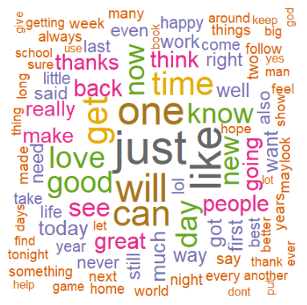
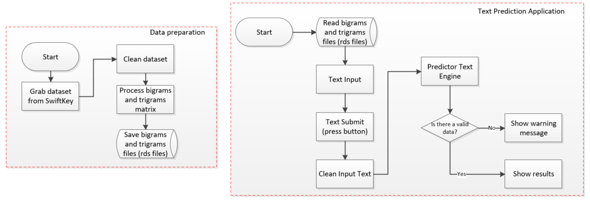
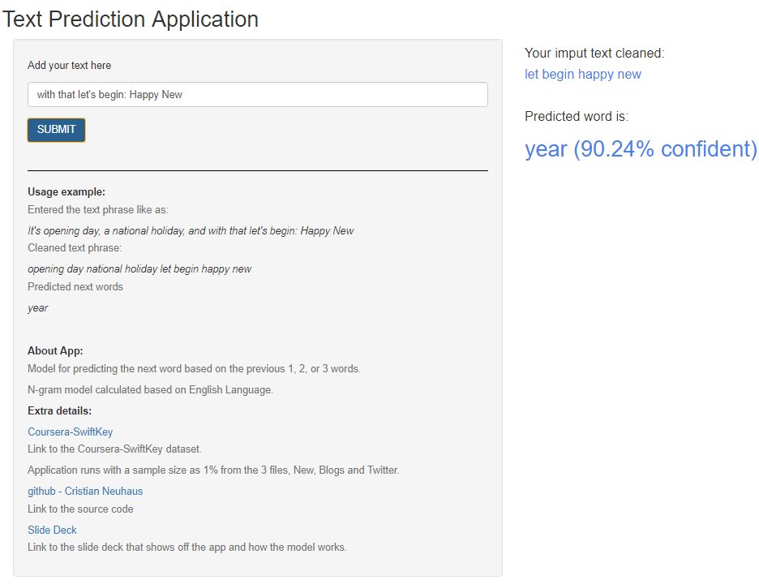

```{r setup, include=FALSE}
knitr::opts_chunk$set(echo = FALSE)

```
```{r libraries, include=FALSE}
if(!require(knitr))install.packages("knitr")
library(knitr)
```

## Application Overview

World and Technology are changing fast. People are increasing amount of time on their mobile devices, for a whole range of activities. Typing can be a serious pain.  
This App is a cornerstone predicting the next word that someone types, saving time and make the life easier.  

Some resources used into this application:  
- [Natural Language Processing - NLP](https://cran.r-project.org/web/views/NaturalLanguageProcessing.html).  
- [Text Mining](https://www.jstatsoft.org/article/view/v025i05).   
- [SwiftKey dataset](https://d396qusza40orc.cloudfront.net/dsscapstone/dataset/Coursera-SwiftKey.zip).  
- [RStudio - Shiny App](https://shiny.rstudio.com/).
```{r out.width = "20%", fig.align = "right", echo=FALSE}

```

## How this App works?  
High Level of data preparation and Shiny App Architecture:  
```{r out.width = "100%", fig.align = "center", echo=FALSE}

```
<b>2 steps:</b>  
- Data preparation.  
- Text Prediction Application (Shiny App).  

## Text Prediction Application{.smaller}   
```{r out.width = "75%", fig.align = "center", echo=FALSE}

```

- The App returns your input text cleaned and the predicted next word in less than a second.   

## Notes 

- Application runs with a sample size as 1% from the 3 files, News, Blogs and Twitter.  
- Link to [Github](https://github.com/Cristianneuhaus/cristianneuhaus.github.io/tree/master/Coursera/Capstone) to the source code.  
- Try it <b>[Text Prediction Application](https://cn03881.shinyapps.io/FinalProject/)</b>.  

### <b>Next Steps:</b>

- Increase machine power to create more accurate algorithms.  
- Potential of unstructured data:  
-- Voice of Customer.  
-- Costumer Insights.  
-- Automate machine learning and modeling.

**Thank You**  
Cristian Neuhaus - cristian.neuhaus@gmail.com
