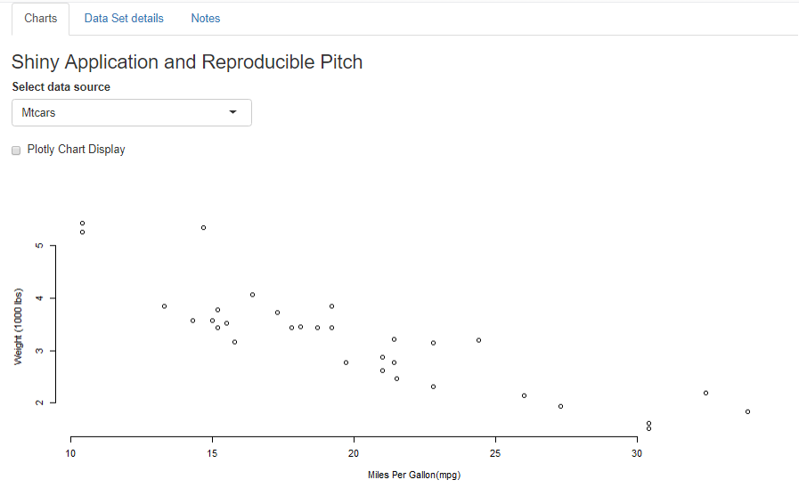
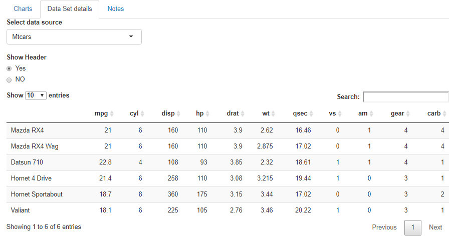

```{r setup, include=FALSE}
knitr::opts_chunk$set(echo = FALSE)

```
```{r libraries, include=FALSE}
if(!require(knitr))install.packages("knitr")
library(knitr)
```

## Overview

This is a Peer-graded Assignment from Data Science Specialization [Coursera course](www.coursera.org).  


Course Project of Developing Data Products, that has two parts:

- Shiny Application and;   
- Reproducible Pitch, that is a presentation about the application.  


## Application Overview

```{r out.width = "80%", fig.align = "center", echo=FALSE}

```

This application contain 3 tabs:

- Charts
- Data Set details
- Notes


## Charts tab overview 
```{r out.width = "80%", fig.align = "center", echo=FALSE}

```
- 3 data sources, <b>mtcars</b>, <b>iris</b> and <b>airmiles</b>  
- Possible to switch chart type between <b>plotly</b> and <b>plot</b>. 


## Data Set details tab overview 
- 3 data sources, <b>mtcars</b>, <b>iris</b> and <b>airmiles</b>  
- Data overview, switch between <b>only header</b> or <b>all data</b>. 

Only header
```{r out.width = "80%", fig.align = "center", echo=FALSE}

```

## Notes tab overview{.smaller} 
Have only text about the reason and author  

Peer-graded Assignment: Data Science Specialization Coursera course  
Developing Data Products  
Cristian Neuhaus  
Date: 26Sep20  

**Thank You**
